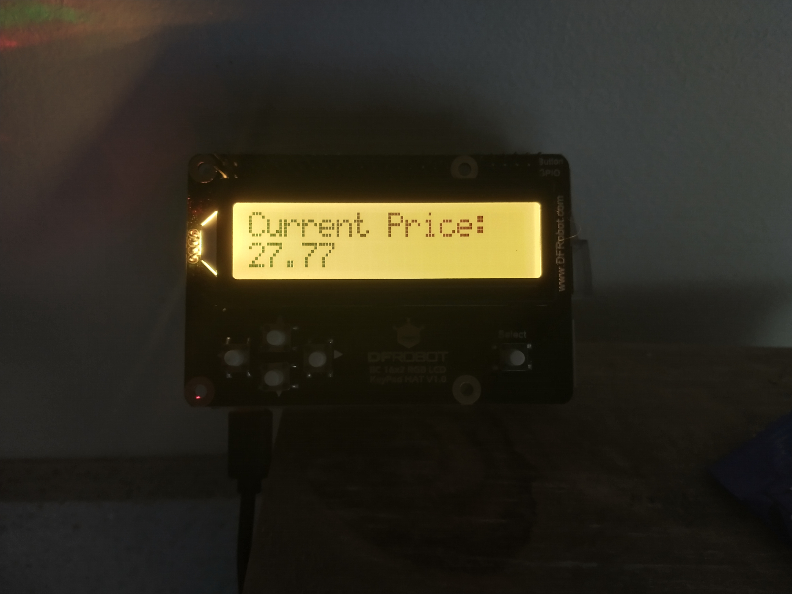

# This is a PI4J v.2 project for reading Agile Octopus electricity prices and putting them on a RGB1602 display

You may freely use it and modify it.

# What does it do?

The programme reads from the Agile Octpus API and gets prices.  It will only display prices in the future (it annoyed me when an Alexa implementation would give cheap prices in the past so I wrote this)

Highlights:

- Colour changes with RGB 1602 LCD display; so green for low prices, yellows etc.  You can configure any RGB colour you want.
- Polls at 1600 for new prices
- stable
- Buttons now implemented to allow 'skipping displays'.
- auto Ticker between:
    +   Future Price
    +   Cheapest overnight Price
    +   Cheapest 1.5 hour segment (average)
    +   Next 30 minutes
    +   Next 60 minutes

If you want something else implemented, let me know.  Or submit a pull request.

If you're moving to Octopus Agile and you think this kit is useful, please use my OCTOPUS energy referral:
<a href="https://share.octopus.energy/aqua-sun-769"> AQUA-SUN-769 </a>

Josh Harney.